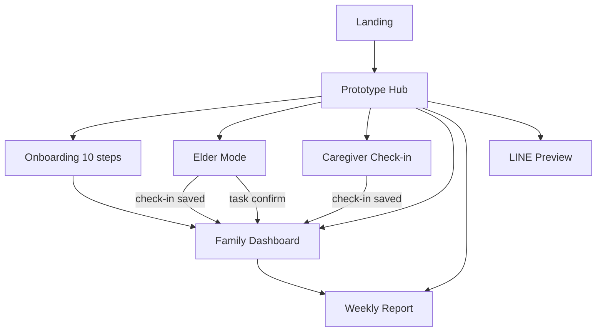

# UX Wireframe Spec — CareKin Phase 1 Prototype

> เวอร์ชัน: 1.0  
> วันที่: 2026-06-12  
> วัตถุประสงค์: Figma handoff สำหรับต้นแบบ Phase 1 — UX validation ก่อน MVP

---

## 1. Overview

CareKin เป็น Family Care Companion Platform สำหรับครอบครัวไทยที่ดูแลผู้สูงวัย ต้นแบบ Phase 1 ครอบคลุม 6 flow หลัก:

1. Prototype Hub — เลือกมุมมองทดสอบ
2. Onboarding — 10 ขั้นตอน (≤ 10 นาที)
3. Elder Mode — ปุ่มใหญ่ ยืนยันงาน + check-in
4. Caregiver Check-in — ฟอร์มเร็ว (≤ 60 วินาที)
5. Family Dashboard — สถานะวันนี้
6. Weekly Report + LINE Preview — รายงานและแจ้งเตือน

**Clickable prototype:** `npm run dev` → http://localhost:3000/prototype

---

## 2. Design Tokens

### 2.1 Colors (semantic — ไม่ใช้เพื่อวินิจฉัย)

| Token | Usage | OKLCH |
|---|---|---|
| Primary | ปุ่มหลัก, links | `oklch(45% 0.12 250)` |
| Success | ทำแล้ว, ปกติ | `oklch(55% 0.15 145)` |
| Warning | รอดำเนินการ, แจ้งครอบครัว | `oklch(75% 0.15 75)` |
| Destructive | พลาด, เร่งด่วน | `oklch(55% 0.2 25)` |
| LINE Green | ปุ่ม LINE flex message | `oklch(65% 0.15 145)` |

### 2.2 Typography

| Mode | Base size | Touch target |
|---|---|---|
| Elder | 20–22px | min 56×56px |
| Family/Caregiver | 16px | min 44×44px |

**Font:** Noto Sans Thai (Google Fonts)

### 2.3 Spacing & Radius

- Card padding: 20px
- Border radius: 12px (xl)
- Section gap: 24px

---

## 3. Component Inventory (Figma)

| Component | Variants | Notes |
|---|---|---|
| Button | default, outline, success, ghost | sizes: default, lg, elder |
| ElderButton | full-width, min-h 56px | ใช้ใน Elder mode เท่านั้น |
| Card | default | border + shadow-sm |
| StatusBadge | done, pending, missed | pill shape |
| AlertBadge | info, family, urgent | pill shape |
| MoodPicker | 3-option, 2-option | elder = stacked full-width |
| ProgressSteps | step counter + bar | onboarding |
| PrototypeBanner | fixed top | "โหมดต้นแบบ — ข้อมูลจำลอง" |
| SafetyDisclaimer | text-xs muted | ทุกหน้าที่เกี่ยวกับสุขภาพ |
| TaskCard | elder/standard | clickable task item |
| StatusCard | icon + value + badge | dashboard metrics |
| LineBubble | incoming/outgoing/admin | LINE chat mockup |

---

## 4. Screen Specifications

### 4.1 Landing (`/`)

**Frame:** Desktop 1280×800 / Mobile 390×844

```
┌─────────────────────────────┐
│         CareKin             │
│   แพลตฟอร์มช่วยครอบครัว...   │
│                             │
│   [ เปิดต้นแบบ Phase 1 ]    │
└─────────────────────────────┘
```

**Copy:**
- Title: "CareKin"
- Subtitle: "แพลตฟอร์มช่วยครอบครัวดูแลผู้สูงวัย — บันทึก แจ้งเตือน และสรุปข้อมูลการดูแล"
- CTA: "เปิดต้นแบบ Phase 1"

---

### 4.2 Prototype Hub (`/prototype`)

**Frame:** Mobile 390×844 (primary), Desktop 1280×900

**Persona:** UX tester / product team

**Layout:**
```
[Prototype Banner]
[Nav: หน้าหลัก | Onboarding | ผู้สูงวัย | ...]
┌─────────────────────────────┐
│ เลือกมุมมองทดสอบ             │
│ เลือกบทบาทเพื่อทดลอง...      │
├──────────┬──────────────────┤
│ 🚀       │ 👨‍👩‍👧              │
│ เริ่มต้น  │ ลูกหลาน           │
├──────────┼──────────────────┤
│ 👴       │ 🩺               │
│ ผู้สูงวัย │ ผู้ดูแล           │
├──────────┼──────────────────┤
│ 📋       │ 💬               │
│ รายงาน   │ LINE             │
└──────────┴──────────────────┘
```

**Cards (6):**
1. เริ่มต้นใช้งาน — onboarding ≤ 10 นาที
2. ลูกหลาน / Family Admin — dashboard comprehension
3. ผู้สูงวัย / Elder — ปุ่มใหญ่
4. ผู้ดูแล / Caregiver — check-in ≤ 60 วินาที
5. รายงานสรุป — AI mock
6. LINE Reminder — message preview

---

### 4.3 Onboarding Wizard (`/prototype/onboarding`)

**Frame:** Mobile 390×844  
**Steps:** 10 (progress bar at top)

| Step | Title | Fields / Content |
|---|---|---|
| 1 | ยินดีต้อนรับ | welcome text + safety disclaimer |
| 2 | สร้าง workspace | ชื่อครอบครัว (text input) |
| 3 | เพิ่มผู้สูงวัย | ชื่อ, อายุ, โรคประจำตัว |
| 4 | ช่องทางการใช้งาน | LINE เอง / Caregiver ช่วย (2 cards) |
| 5 | เพิ่มยา | ชื่อยา, เวลา, ขนาด |
| 6 | เพิ่ม routine | ชื่อ, เวลา |
| 7 | เชิญครอบครัว | อีเมล + mock invite link |
| 8 | ผู้ติดต่อฉุกเฉิน | ชื่อ, เบอร์โทร |
| 9 | เปิด check-in | checkbox toggle |
| 10 | พร้อมใช้งาน | success + CTA → Dashboard |

**Navigation:** ถัดไป / ย้อนกลับ / ข้ามไปทดสอบหน้าอื่น

**Exit criteria:** ผู้ใช้ทำ onboarding ได้ภายใน 10 นาที

---

### 4.4 Elder Mode (`/prototype/elder`)

**Frame:** Mobile 390×844 (elder-first)

#### View: Home
```
สวัสดีค่ะ คุณสมศรี
งานวันนี้
┌─────────────────────────┐
│ กินยาเช้า        [เสร็จ] │
│ ยาความดัน 1 เม็ด         │
├─────────────────────────┤
│ วัดความดัน       [เสร็จ] │
│ ทุกเช้า 07:30            │
├─────────────────────────┤
│ บันทึกวันนี้    [รอดำเนิน]│
│ Check-in รายวัน          │
└─────────────────────────┘
```

#### View: Task Confirm
- Title: task name
- Buttons (full-width, 56px min): "ทำแล้ว" (green) / "ยังไม่ได้" (outline)

#### View: Check-in (5 questions)
1. วันนี้รู้สึกอย่างไร → ดี / ปานกลาง / ไม่ค่อยดี
2. มีอาการผิดปกติไหม → ใช่ / ไม่
3. มีการหกล้มหรือเกือบหกล้มไหม → ใช่ / ไม่
4. กินอาหารได้ปกติไหม → ใช่ / ไม่
5. นอนหลับเป็นอย่างไร → ดี / ปานกลาง / ไม่ดี

#### View: Success
- "บันทึกเรียบร้อย"
- "ลูกหลานจะเห็นข้อมูลในหน้า dashboard"
- CTA: ดู Dashboard

**Accessibility:**
- Font: 20–22px
- Buttons: stacked, full-width
- Max 3–5 actions per screen
- Contrast: WCAG AA+

---

### 4.5 Caregiver Check-in (`/prototype/caregiver`)

**Frame:** Mobile 390×844

**Layout:** Single scroll form

```
บันทึก check-in                    [45s timer]
กรอกให้ครบภายใน 60 วินาที

┌─ ผู้สูงวัย ─────────────────────┐
│ คุณสมศรี — อายุ 78 ปี           │
└─────────────────────────────────┘

┌─ Check-in questions (compact) ──┐
│ [same 5 questions as elder]      │
└─────────────────────────────────┘

┌─ ค่าสุขภาพ (ไม่บังคับ) ──────────┐
│ SYS | DIA | ชีพจร | น้ำตาล       │
└─────────────────────────────────┘

หมายเหตุเพิ่มเติม [textarea]

[ บันทึกเสร็จ ]
```

**Timer:** Shows elapsed seconds; green ≤60s, amber >60s

**Defaults pre-filled:** mood=ดี, symptoms=ไม่, fall=ไม่, appetite=ใช่, sleep=ดี

**Exit criteria:** ≤ 60 วินาที

---

### 4.6 Family Dashboard (`/prototype/family`)

**Frame:** Desktop 1280×900 (primary), Mobile 390×844

```
Dashboard — คุณสมศรี — วันศุกร์ที่ 12 มิถุนายน 2569
                                    [ดูรายงาน]

สถานะวันนี้
┌──────────┬──────────┬──────────┐
│ Check-in │ ยาวันนี้  │ ค่าล่าสุด │
│ เสร็จแล้ว │  2/3     │ 132/82   │
└──────────┴──────────┴──────────┘

งานที่ยังไม่ทำ
┌─────────────────────────────────┐
│ ยาเย็น — 18:00        [แจ้งซ้ำ] │
└─────────────────────────────────┘

กิจกรรมล่าสุด (timeline)
การแจ้งเตือน (badges: info/family/urgent)
แนวโน้ม 7 วัน (bar chart)
```

**Exit criteria:** เข้าใจได้โดยไม่ต้องอธิบายยาว

---

### 4.7 Weekly Report (`/prototype/report`)

**Frame:** Desktop 1280×900

**Sections:**
1. Period tabs: 7 / 14 / 30 วัน
2. Medication adherence % + check-in count
3. Vitals table
4. Alerts log
5. AI Summary block (highlighted card):
   - summary
   - key_observations
   - missed_routines
   - values_outside_user_configured_ranges
   - questions_for_doctor
   - caregiver_notes_summary
   - safety_disclaimer
6. Actions: "ตรวจทานก่อนส่ง" (disabled), "Export PDF" (mock modal)

**Mock vs Future:**
- AI summary: static mock (Phase 5 = real AI)
- PDF export: modal "จะพร้อมใน Phase 5"

---

### 4.8 LINE Preview (`/prototype/line`)

**Frame:** Mobile 390×844

**Chat mockups (3 scenarios):**

1. **Medication reminder** to elder:
   - "ถึงเวลากินยาแล้วค่ะ"
   - Flex buttons: "✅ ทำแล้ว" / "⏳ ยังไม่ได้"

2. **Missed reminder** to elder:
   - "แจ้งเตือน: ยังไม่ได้ยืนยันกินยา"

3. **Escalation** to family admin:
   - "⚠️ คุณสมศรี ยังไม่ได้ยืนยันกินยาเย็น"

**Note:** "การส่งจริงจะเชื่อมใน Phase 3"

---

## 5. User Flow Diagram



---

## 6. Mock Data Reference

**Elder persona:** คุณสมศรี ใจดี, 78 ปี, ความดัน + เบาหวาน

**Medications:** 3 (morning done, noon done, evening pending)

**Routines:** วัดความดัน (done), วัดน้ำตาล (missed)

**Emergency contact:** สมชาย ใจดี (ลูกชาย) 081-234-5678

Source: `src/lib/mock-data.ts`, `src/lib/copy.ts`

---

## 7. Accessibility Checklist

- [ ] Font size ≥ 20px in Elder mode
- [ ] Touch targets ≥ 56px in Elder mode
- [ ] Color contrast ≥ 4.5:1 (WCAG AA)
- [ ] Status communicated by text + color (not color alone)
- [ ] Focus visible on all interactive elements
- [ ] Thai language: simple, no medical jargon
- [ ] Safety disclaimer on health-related screens
- [ ] No diagnostic language in UI copy

---

## 8. Annotations for Figma

| Element | Phase 1 | Future Phase |
|---|---|---|
| All data | Mock / localStorage | Supabase + RLS (Phase 2) |
| LINE messages | Static preview | LINE Messaging API (Phase 3) |
| AI report | Static mock text | OpenAI + guardrails (Phase 5) |
| PDF export | Modal placeholder | Real export (Phase 5) |
| Auth / invite | Mock link | Supabase Auth (Phase 2) |
| Reminder send | Button mock | Job queue (Phase 3) |

---

## 9. File Mapping (Code → Figma Frame)

| Figma Frame Name | Route | Source File |
|---|---|---|
| CK-00 Landing | `/` | `src/app/page.tsx` |
| CK-01 Hub | `/prototype` | `src/app/prototype/page.tsx` |
| CK-02 Onboarding | `/prototype/onboarding` | `src/app/prototype/onboarding/page.tsx` |
| CK-03 Elder Home | `/prototype/elder` | `src/app/prototype/elder/page.tsx` |
| CK-04 Caregiver | `/prototype/caregiver` | `src/app/prototype/caregiver/page.tsx` |
| CK-05 Dashboard | `/prototype/family` | `src/app/prototype/family/page.tsx` |
| CK-06 Report | `/prototype/report` | `src/app/prototype/report/page.tsx` |
| CK-07 LINE | `/prototype/line` | `src/app/prototype/line/page.tsx` |
